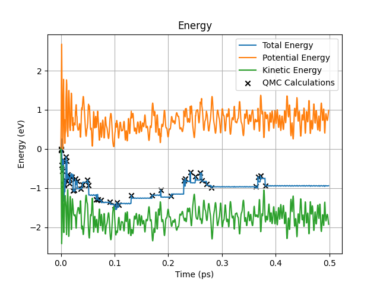
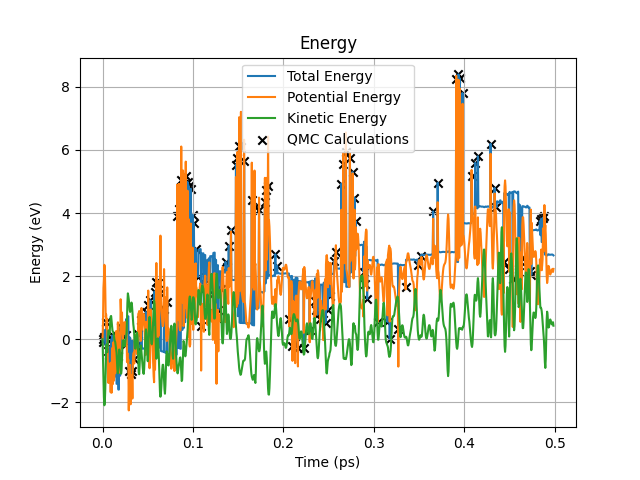

# CHAMP-ASE-FLARE

This repository contains tools to connect CHAMP to [ASE](https://gitlab.com/ase/ase) and to use it together with a Machine Learning Force Field algorithm called [FLARE](https://github.com/mir-group/flare). In this README we will go over the process of using the CHAMP calculator and how to use FLARE with it.

# Installation

To install this packages, simply clone it and install it using pip:
```
git clone https://github.com/NLESC-JCER/CHAMP-ASE-FLARE.git
cd CHAMP-ASE-FLARE
pip3 install .
```
## Installing CHAMP

To use this software, you need a special version of CHAMP which can export the forces and energy to a file. For this you need to [ase-coupling](https://github.com/filippi-claudia/champ/tree/ase-coupling) branch. Simply clone this and build in the usual way.

## ASE CHAMP calculator
The CHAMP calculator can used in ASE for any kind of simulation. After importing the calculator, a new CHAMP calculator object can be made using:
```
from caf.champ import CHAMO
champ_calc = CHAMP(champ_loc="/home/user/champ/bin/vmc.mov1", force_file="write_forces", ncore=4)
```
The CHAMP specific parameters that can be set are:
- `vmc_in` -- The input file for CHAMP (default 'vmc.inp')
- `vmc_out` -- The output file of CHAMP (default 'vmc.out')
- `force_file` -- The file that CHAMP writes the forces and energies to (default 'write_forces')[^1]
- `pos_file` -- The file from which CHAMP will read to location of the atoms (default 'molecule.xyz')[^2]
- `champ_loc` -- Location of the CHAMP executable (default '/usr/bin/vmc.mov1')
- `nodefile` -- If set, the calculator will run on multiple nodes for CHAMP
- `ncore` -- Amount of cores to run CHAMP on (default 1)

[^1]: As of now there is no way to set this in CHAMP, so 'write_forces' should be used.
[^2]: Should match the name in the CHAMP input file.

To attach this calculator to a molecule and do Molecular Dynamics, we can do:
```
from ase.md.verlet import VelocityVerlet
from ase.build import molecule

# Make a H2 molecule
atoms = molecule("H2")

# Attach the calculator
atoms.calc = champ_calc

# Setup and run MD
dyn = VelocityVerlet(atoms, 0.5 * units.fs) 
dyn.run(30)
```

## FLARE
[FLARE](https://github.com/mir-group/flare) is an on-the-fly Force Field Machine Learning packages. It uses Gaussian Process regression to train the Force Field. However, unfortunatly for use it only works for atoms in a box, since it also determines the stress. Without a box, you cannot calculate stress. We circumvent this by placing the molecule in a big box and letting the CHAMP calculator pass a null tensor. The second problem is that it only works up to 3-body interactions. However for MD we idealy want atleast 4-body interactions. This is where [FLARE++](https://github.com/mir-group/flare) comes in. FLARE++ is an extension to FLARE to allow for n-body interactions. This package contians a modified version of the on-the-fly learning code from FLARE, to make it work well with QMC. To this aim, there is also a modified Velocity Verlet scheme which must be used.

### Installation
Installing FLARE++ on CCPGATE is a little bit more tedious. In my experience I found that the method of building CHAMP (probably by setting the environment variable `LD_LIBRARY_PATH`) can interfere. I would recommend installing this package before any building of CHAMP in a session. If FLARE++ cannot be imported, remove and reinstall the packages after [^3]:
```
unset LD_LIBRARY_PATH
```

[^3]: Note that is method is not tested. Installing FLARE++ before any CHAMP tinkering is recommended.

### Running
To do a ab-initio on-the-fly FF training together with champ, start by importing (assuming the CHAMP calculator is already imported):
```
# flare++ imports
import flare_pp._C_flare as flare_pp
from flare_pp.sparse_gp import SGP_Wrapper
from flare_pp.sparse_gp_calculator import SGP_Calculator

# flare imports
from caf.otf import C_ASE_OTF as ASE_OTF
```
Now we will build a molecule and put it in a big box (in this case we will go for thiophene):
```
from ase import Atoms
from ase.atoms import Cell

atoms = Atoms('C4SH4', [(0,0.71495093597,1.31902341514), (0,-0.71495093597,1.31902341514), (0,-1.24055334534,0.05119099544), (0,1.24055334534,0.05119099544), (0,0,-1.15285178278), (0,1.32194923477,2.21441153704), (0,-1.32194923477,2.21441153704), (0,2.27909548764,-0.24288695123), (0,-2.27909548764,-0.24288695123)])
atoms.cell  = Cell.fromcellpar([50, 50, 50, 90, 90, 90])
atoms.pbc=[True, True, True]
n_atoms = len(atoms)
```
After this we have to setup the MD and the on-the-fly training. For more details I point you towards the FLARE documentation.
```
# Set MD parameters. Note: I use the custom Velocity Verlet scheme to be used with CHAMP
md_engine = "CustomVerlet"
md_dict = {}

# Create sparse GP model.
species_map = {16: 0, 6: 1, 1: 2} 
cutoff = 5.0  # in A
sigma = 2.0  # in eV
power = 2  # power of the dot product kernel
kernel = flare_pp.NormalizedDotProduct(sigma, power)
cutoff_function = "quadratic"
many_body_cutoffs = [cutoff]
radial_basis = "chebyshev"
radial_hyps = [0., cutoff]
cutoff_hyps = []
n_species = 3
N = 12
lmax = 3
descriptor_settings = [n_species, N, lmax]
descriptor_calculator = flare_pp.B2(
  radial_basis,
  cutoff_function,
  radial_hyps,
  cutoff_hyps,
  descriptor_settings
)

# Set the noise values.
sigma_e = 0.12 * n_atoms  # Energy noise (in kcal/mol, so about 5 meV/atom)
sigma_f = 0.115  # Force noise (in kcal/mol/A, so about 5 meV/A)
sigma_s = 0.014  # Stress noise (in kcal/A^3, so about 0.1 GPa)
# Choose uncertainty type.
# Other options are "DTC" (Deterministic Training Conditional) or
# "SOR" (Subset of Regressors).
variance_type = "local"  # Compute uncertainties on local energies (normalized)

# Choose settings for hyperparameter optimization.
max_iterations = 10  # Max number of BFGS iterations during optimization
opt_method = "L-BFGS-B"  # Method used for hyperparameter optimization

# Bounds for hyperparameter optimization.
# Keeps the energy noise from going to zero.
bounds = [(None, None), (sigma_e, None), (None, None), (None, None)]

# Create a model wrapper that is compatible with the flare code.
gp_model = SGP_Wrapper([kernel], [descriptor_calculator], cutoff,
                    sigma_e, sigma_f, sigma_s, species_map,
                    variance_type=variance_type,
                    stress_training=False,
                    opt_method=opt_method,
                    bounds=bounds,
                    max_iterations=max_iterations)

# Create an ASE calculator based on the GP model.
flare_calculator = SGP_Calculator(gp_model)

# Set up OTF object.
init_atoms = list(range(n_atoms))  # Initial environments to include in the sparse set
output_name = 'thio'  # Name of the output file
std_tolerance_factor = -0.01  # Uncertainty tolerance for calling DFT
freeze_hyps = 10  # Freeze hyperparameter optimization after this many DFT calls
min_steps_with_model = 0  # Min number of steps between DFT calls
update_style = "threshold"  # Strategy for adding sparse environments
update_threshold = 0.005  # Threshold for determining which sparse environments to add

otf_params = {'init_atoms': init_atoms, 'output_name': output_name,
              'std_tolerance_factor': std_tolerance_factor,
              'freeze_hyps': freeze_hyps,
              'force_only': False,
              'min_steps_with_model': min_steps_with_model,
              'update_style': update_style,
              'update_threshold': update_threshold}
              
champ_calc = CHAMP(champ_loc="/home/user/bin/vmc.mov1", force_file="write_forces", ncore=4)

# Create OTF object.
timestep = 0.5 * units.fs
number_of_steps = 50
test_otf = ASE_OTF(
    atoms, timestep=timestep, number_of_steps=number_of_steps,
    dft_calc=champ_calc, md_engine=md_engine, md_kwargs=md_dict,
    calculator=flare_calculator, **otf_params)

# Run on-the-fly dynamics.
test_otf.run()
```
## Analysing data
Due to the custom Velocity Verlet scheme, the kinetic energy is one step out of phase with the potential energy. To make it easier to analyze the data, I included a few tools to do so. These tools also align the potential and kinetic energy:
```
from caf.tools import Analyse

# Import the thio.out file
data = Analyse('thio.out')

# Create the traj.xyz file
data.to_xyz()

# Returns a dictionary containing the keys 'times', 'potential energy', 'kinetic energy',
# 'total energy' and 'temperature'
results = data.get_data()

# Plot the energy and save it to energy.png
data.plot_energy(filename="energy.png")
```
## Issues
There are some issues which still need to be ironed out
1. In the initial two steps, the energy is badly conserved. I think this has something to do with how the first step of the verlet is taken.
2. FLARE++ sometimes crashes when the number of hyperparameter optimization steps is too big. Cause: unknown

## Results
In the [examples](examples) folder I uploaded two examples. One for thiophene at 300K and one for thiophene at 300K but in the excited state geometry. I also included a python script `plot.py` to convert the `thio.out` file to energy plots and a `traj.xyz` which is the trajectory of the atoms over time in xyz format. In the image below you can see the energy over time of the thiophene in the ground state geometry. You can see that the energy fluctuates a bit in the beginning because CHAMP is mostly during the work there, but once the ML FF is properly trained the energy stays relatively constant. This simulation consisted of 1000 timesteps, of which CHAMP was called 47 times.



However, for the excited state geometry, the results are less favourable. As you can see, the energy fluctuates quite a bit, and the ML FF also never fully takes over. In this case it seems FLARE has difficulty learning the correct energy, as there is a few eV difference between FLARE and CHAMP. This simulation consisted of 1000 timesteps, of which CHAMP was called 134 times.



## Parameters

- I found that for the excited state geometry it sometimes has difficulty learning the correct energy. I think that setting `max_iterations` lower can help in those cases, although I have not 100% tested this. For the excited geometry a value of about 10 seems to work, while in the ground state geometry 20 also works.
- Setting `std_tolerance_factor` too strict is definitly not useful. Then FLARE will never take over from CHAMP. I don't think I would recommend setting `std_tolerance_factor` smaller than -0.01 (negative numbers are absolute force thresholds, while positive numbers are ratios with respect to the noise). If you would like to set a ratio with respect to the noise, setting `std_tolerance_factor` to 0.01 also seems to work okay, although there is a lot to test in this regard.
