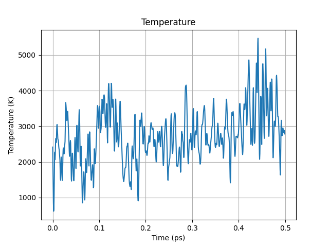

Thiophene 300K Excited State Geometry
=====================================

Running the simulation
----------------------

.. literalinclude:: ../../examples/thio-300K-ex/run.py

Analyzing the simulation
------------------------

.. literalinclude:: ../../examples/thio-300K-ex/plot.py

.. image:: ../../examples/thio-300K-ex/energy.png
   :width: 600

